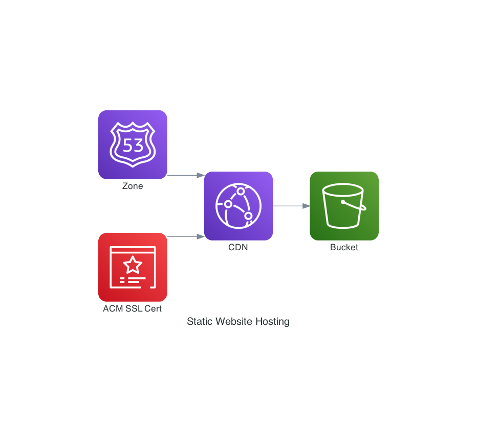

# terraform-aws-s3-website-cloudfront-acm-route53

Assumes use of Terraform v0.15.

This is a setup for hosting a static website leveraging the following AWS services:

- S3
- CloudFront
- Route 53
- ACM

The architecture nets to look like this:



This repo exists because I spent a fair amount of time stitching this together and it took a while to get to the setup I typically run. This is going to be my starter kit for new static websites.

A lot of what's in here I did find in gists, repos, and blog posts of folks along with the terraform docs. Thank you all for sharing. Apologies, as I didn't do a good job of keeping track of all places where I was able to get snippets to give credit.

You will get HTTPS by default with these templates with automatic redirects for HTTP to HTTPS.

Logs from CloudFront will go to a S3 bucket and logs will be expired after 90 days by default.

## Which version of this is right for me?

### Best Practice Version
Use this to start if you're not sure. It uses an origin access identity to permit CloudFront to read from your private S3 bucket.

### Subdirectories with indexes
This is the one you should use if you have situations where subdirectories have an `index.html`, but the references in your website don't explicitly reference `index.html`.

Example where you will have problems with the best practice version:

```
https://example.com/subdir/
```

CloudFront will only automatically render `index.html` in the root path, not sub directories. This version is more permissive with read permissions on the S3 bucket and uses the s3 website URL as the origin in CloudFront. The only files that are different across the best practice and this version are `cloudfront.tf` and `s3.tf`.

## Setup

1. Install [terraform](https://www.terraform.io/) (Currently this is for v0.13.x)
1. My environment has all of my AWS credentials set in `~/.aws/credentials` which terraform leverages.


## Usage

1. Update `variables.tf` to reflect your site configuration
1. Run `terraform init` to initialize everything.
1. Run `terraform plan` to see what terraform is going to do.
1. Run `terraform apply` to have it setup the infrastructure

***Further action required***: You will need to take the name server outputs for the domain and update your registrar to point to the name servers that you see at the end of the terraform run.

## Troubleshooting

Not a lot to put here, if resources exist such as zones in Route53 or buckets in S3, you will need to use different buckets.

***Most likely failure***: This ACM setup makes the assumption that you are the owner of the domain and can sign off on a certificate being used. With ACM, you may need to run `terraform apply` multiple times since the ACM cert may not be ready by the time terraform is setting up CloudFront.
